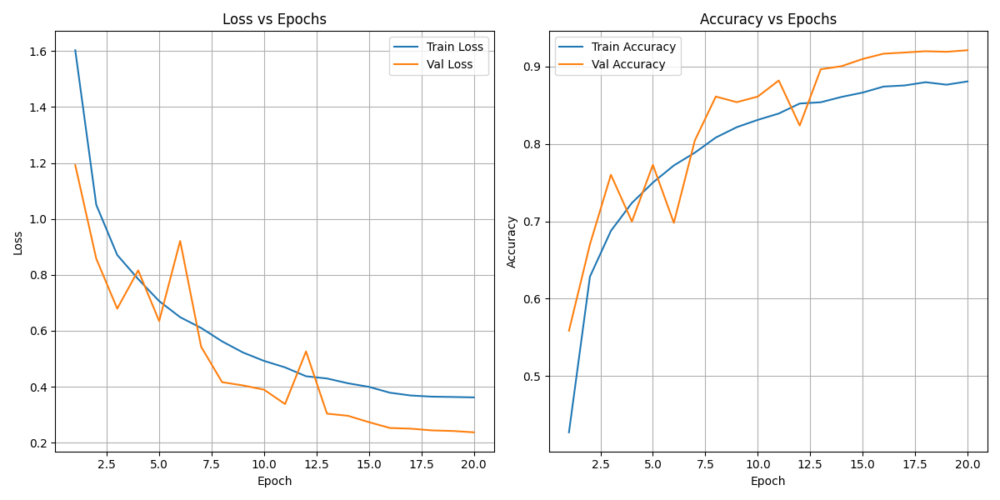
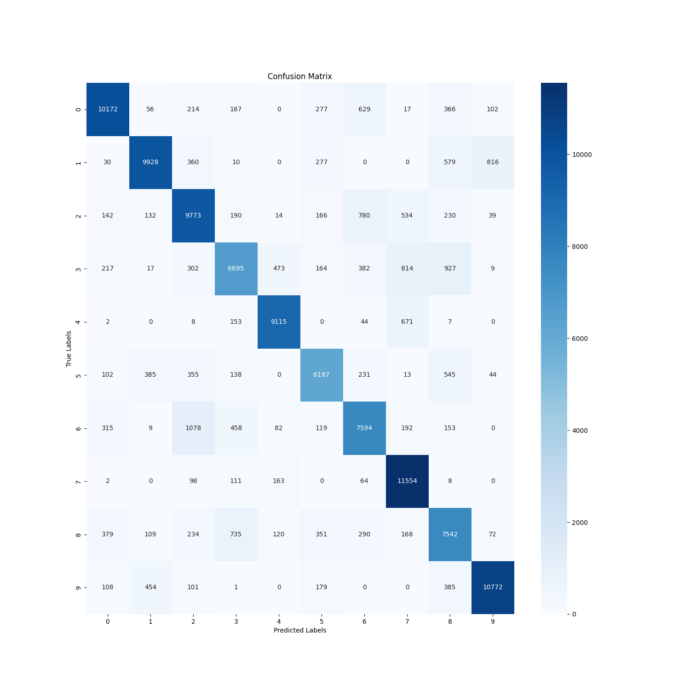
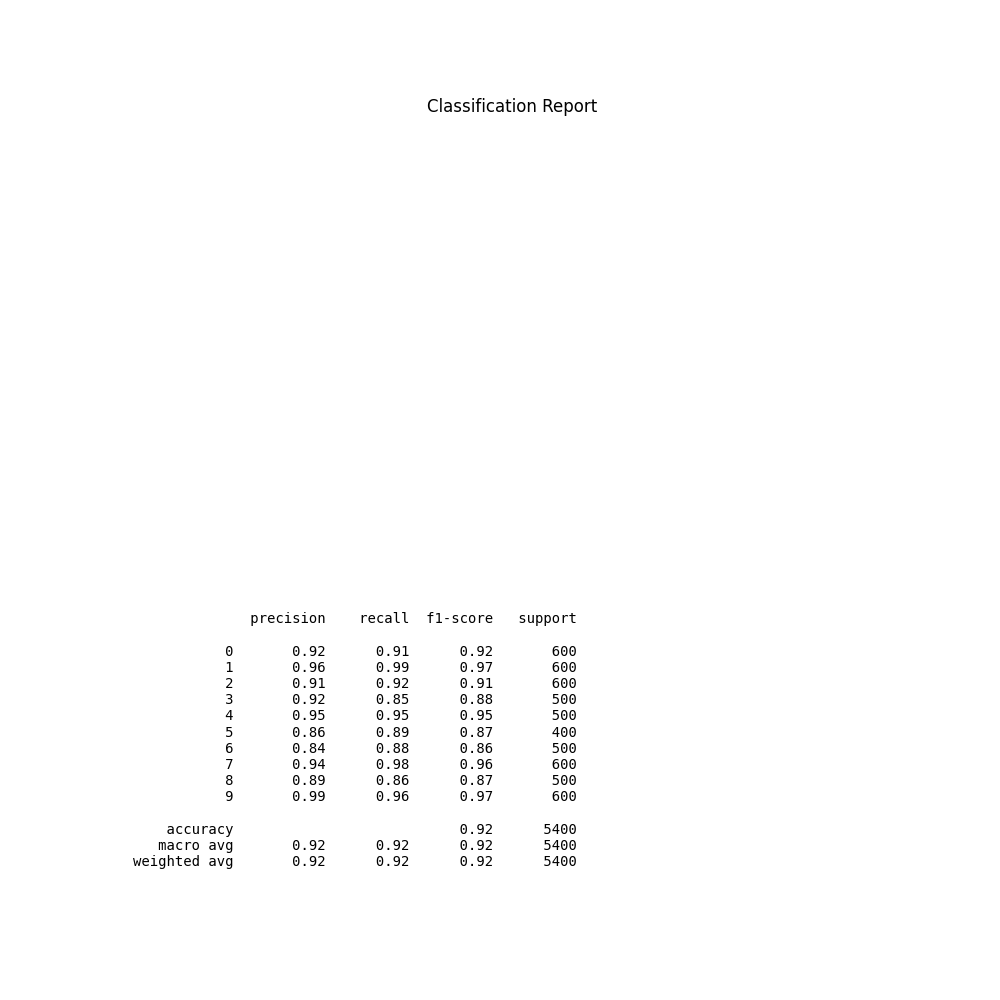
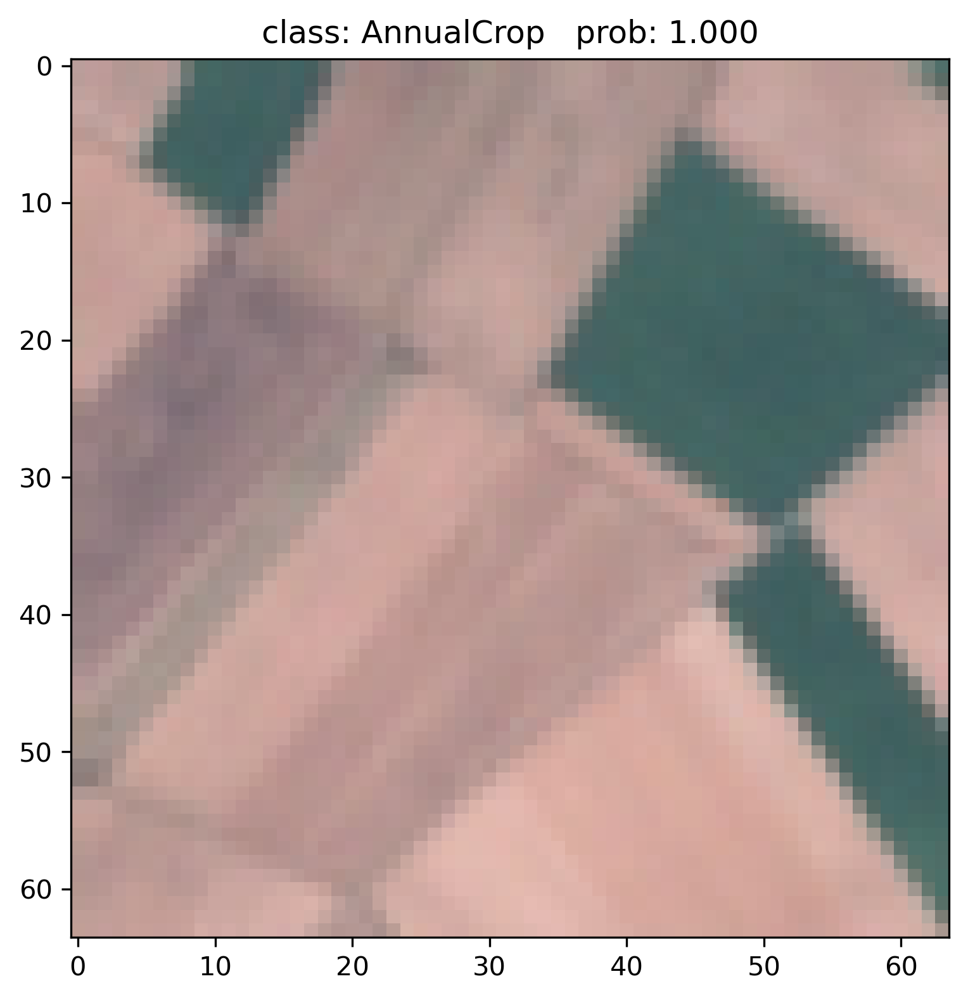
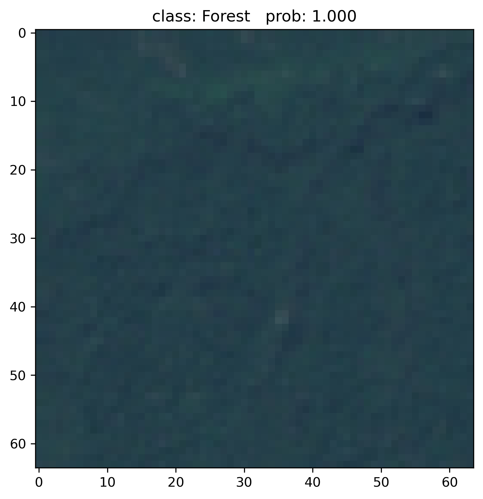
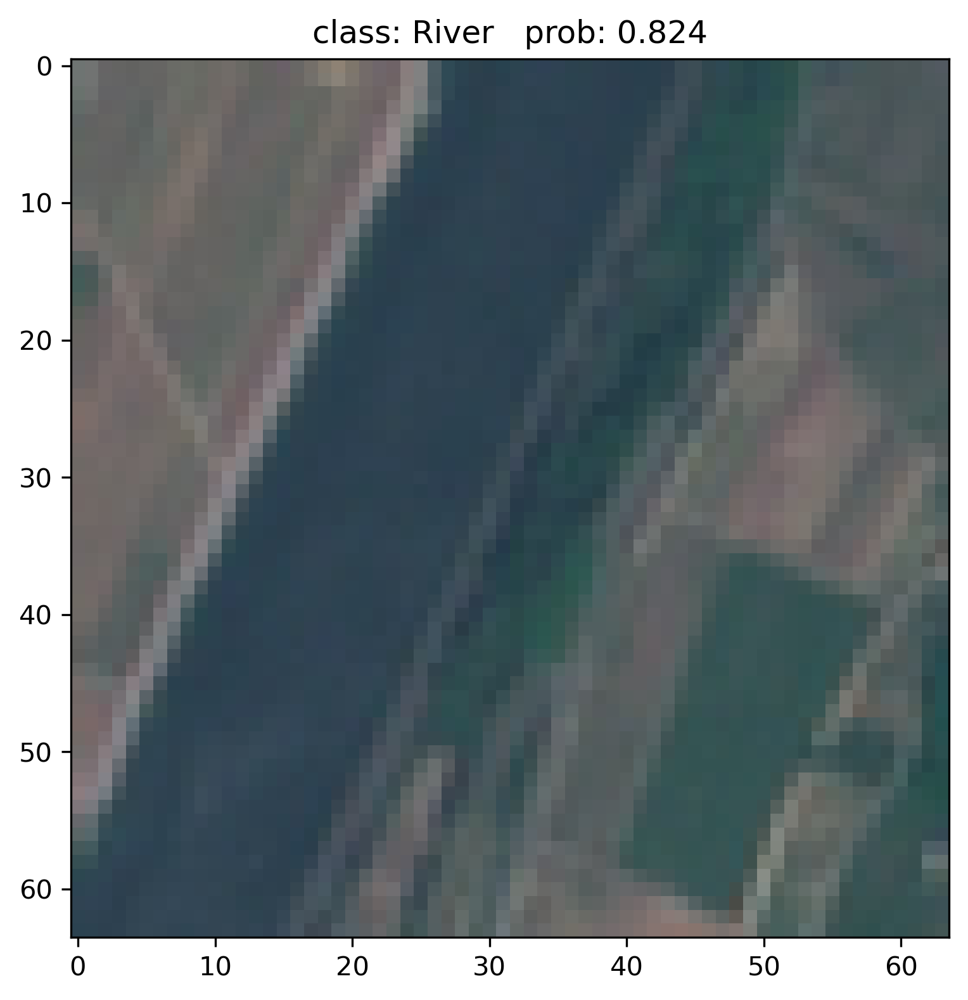

# SatVision: Advanced Land Cover and Land Use Classification Using Sentinel-2 Imagery

## Table of Contents
1. [About the Project](#about-the-project)
   - [Background](#background)
   - [Challenges](#challenges)
   - [SENTINEL-2 Satellite](#sentinel-2-satellite)
     - [Dataset Introduction](#dataset-introduction)
     - [Dataset Advantages](#dataset-advantages)
2. [Research Methodology](#research-methodology)
   - [Innovative Solution](#innovative-solution)
3. [Results and Visualization](#results-and-visualization)
4. [Environment Configuration](#environment-configuration)
5. [Application Value](#application-value)
6. [Conclusion and Future Work](#conclusion-and-future-work)
7. [Acknowledgments](#acknowledgments)
8. [References](#references)

## About the Project
SatVision focuses on land cover and land use classification using Sentinel-2 satellite imagery combined with deep learning technology. Through an innovative hybrid model architecture that integrates the local feature extraction capabilities of convolutional neural networks with the global feature fusion capabilities of Transformers, we have achieved highly accurate classification results that outperform traditional models such as AlexNet, ResNet50, and pure Transformer approaches.

### Background
Why perform land cover and land use classification?

Land cover and land use classification is crucial for:
- Environmental monitoring: Tracking deforestation, urban expansion, and ecosystem changes
- Resource management: Optimizing agricultural land, water resources, and natural resource utilization
- Urban planning: Supporting sustainable development and land use decisions
- Disaster management: Assessing flood, drought, and fire risks and impacts
- Climate change research: Monitoring land use changes that affect carbon emissions and climate

### Challenges
Land cover and land use classification using satellite imagery faces multiple challenges:
- Data complexity: Sentinel-2 imagery contains multiple spectral bands that require effective processing and integration
- Spatial context: Focusing only on local features may lead to classification errors, requiring consideration of global spatial relationships
- Seasonal variation: The same area may present different characteristics in different seasons
- Classification accuracy: Traditional methods perform poorly on complex terrain and mixed land use types
- Computational efficiency: Need to optimize computational resource usage while maintaining high accuracy

### SENTINEL-2 Satellite

#### Dataset Introduction
As one of the flagship projects of the European Space Agency (ESA) Copernicus Programme, the Sentinel-2 satellite system represents an outstanding achievement in modern Earth observation technology. The system consists of twin satellites—Sentinel-2A and Sentinel-2B—which operate in tandem on the same orbit with a precise 180° phase difference, forming an efficient Earth observation network. This ingenious orbital design ensures complete coverage of the Earth's land surface every 5 days, except near the equator, providing unprecedented temporal precision for dynamic monitoring of Earth's changes.

#### Dataset Advantages
The Sentinel-2 satellite system has established new standards in Earth observation with its advanced technical features:
- Multispectral imaging capability: The equipped Multispectral Imager (MSI) provides 13 carefully designed spectral bands, covering a wide spectral range from visible light (443nm) to short-wave infrared (2190nm), capable of capturing unique spectral characteristics of surface materials.
- Optimized spatial resolution: Different bands adopt differentiated spatial resolution designs according to application needs—key visible and near-infrared bands reach 10-meter resolution, red-edge bands are at 20 meters, and atmospheric correction-specific bands are at 60 meters, achieving a perfect balance between resolution and application value.
- Excellent coverage capability: A 290-kilometer ultra-wide swath width, far exceeding traditional remote sensing satellites, allows complete images of large areas to be acquired in a single pass, greatly enhancing data collection efficiency.
- Stable temporal resolution: The twin satellite system works collaboratively to shorten the revisit period to 5 days, and even 2-3 days in high-latitude regions, providing sufficient temporal precision for dynamic change monitoring.
- Leading open data policy: Embracing the concept of open science, all Sentinel-2 data is freely available to global users, significantly lowering the barriers to acquiring Earth observation data and promoting scientific research and technological innovation worldwide.

## Research Methodology

### Innovative Solution
We propose the UltraLightNet-Transformer hybrid model, effectively combining the advantages of convolutional neural networks and Transformers.

#### Model Architecture
Our hybrid model (CombinedNet) consists of three core components:
- UltraLightNet: A lightweight CNN architecture using depth-separable convolutions and efficient parameter design, specifically for extracting local spatial features
  - Uses grouped convolutions to reduce parameter count
  - Adopts SiLU activation function to enhance nonlinear expression capability
  - Strategic pooling to preserve key feature information
- Attention Module: Multi-head self-attention mechanism, capturing global dependencies and long-range feature interactions in images
  - Implements pixel-level global context awareness
  - Enhances understanding of complex land cover patterns
- Classifier: Optimized fully-connected layer design, mapping extracted features to land classification categories

#### Technical Innovations
- Depth-separable convolutions: Significantly reduce model parameters and computational load while maintaining feature extraction capability
- Multi-head self-attention mechanism: Learn feature relationships from different perspectives, enhancing feature representation
- Hybrid architecture design: Seamlessly integrate local feature extraction of convolutional operations with global context modeling of Transformers
- Training time optimization: Innovative model architecture design dramatically shortens training cycles, 62.2% faster than pure Transformer models
- Lightweight efficiency: Our model provides higher computational efficiency and superior performance compared to pure Transformer or large CNN models

## Results and Visualization
We compared our hybrid model with the following baseline models:
- AlexNet: Classic CNN architecture
- ResNet50: Modern residual network architecture
- Transformer: Pure attention mechanism architecture

Our model outperformed all baselines on multiple evaluation metrics:

| Classification Method | Overall Accuracy | Training Time |
|-----------------------|------------------|--------------|
| AlexNet | 86% | 212s |
| ResNet | 90% | 820s |
| Transformer | 82% | 1862s |
| UltraLightNet-Transformer | 92% | 363s |

#### Training Efficiency Advantages
Our model not only surpasses all baseline models in accuracy but also significantly reduces training time costs while maintaining optimal performance:
- 55.7% reduction in training time compared to ResNet50, with a 2% improvement in accuracy
- 80.5% reduction in training time compared to Transformer, with a 10% improvement in accuracy
- Slightly longer training time compared to AlexNet, but with a 6% improvement in accuracy

This efficiency stems from our model architecture innovations:
- Lightweight convolutional structure reduces parameter count and computational complexity
- Depth-separable convolutions significantly lower computational overhead
- Effective integration of attention mechanisms avoids redundant calculations
- Optimized model structure achieves more efficient gradient propagation

#### Model Training
```python
# Model training example code
from model import CombinedNet
import torch		
# Initialize model
model = CombinedNet(num_classes=10)  # Adjust the number of classes according to your classification task
# Prepare data loader
# ...
# Train model
# ...
```

Our training results show the model's performance across different training epochs:




#### Model Inference
```python
# Model inference example code
import torch
from model import CombinedNet
# Load pre-trained model
model = CombinedNet(num_classes=10)
model.load_state_dict(torch.load('model_weights.pth'))
model.eval()
# Inference process
# ...
```

Visualization results of our model's inference in real-world scenarios:




## Environment Configuration
- Python 3.8+
- PyTorch 1.9+
- torchvision
- numpy
- matplotlib
- scikit-learn

## Application Value
Our model can be widely applied in:
- Agricultural monitoring and planning
- Urban expansion analysis
- Environmental protection and ecological restoration
- Land use policy development
- Climate change impact assessment

## Conclusion and Future Work

### Conclusion
Our proposed UltraLightNet-Transformer hybrid model successfully improves the accuracy of land cover and land use classification of Sentinel-2 satellite imagery by combining the local feature extraction capabilities of convolutional neural networks with the global feature fusion capabilities of Transformers. Experimental results show that our model achieves 92% accuracy, significantly outperforming traditional AlexNet (86%), ResNet50 (90%), and pure Transformer models (82%), while dramatically reducing training time, achieving a breakthrough in both performance and efficiency.

Notably, our model achieves the highest accuracy while reducing training time by 80.5% (1862s vs. 363s) compared to current popular pure Transformer models, and by 55.7% (820s vs. 363s) compared to ResNet50. This significant improvement in training efficiency enables faster deployment of the model in practical applications, greatly reducing computational resource consumption and research costs.

This innovative approach provides new insights for remote sensing image analysis and land cover classification, with broad application prospects in environmental monitoring, resource management, urban planning, and other fields, particularly suitable for scenarios requiring rapid training and deployment.

### Future Work
- Explore additional spectral band fusion methods
- Enhance temporal data analysis capabilities
- Optimize model inference speed for real-time analysis
- Extend to more application scenarios, such as precision agriculture and natural disaster monitoring

## Acknowledgments

## References
Krizhevsky, Alex, Ilya Sutskever, and Geoffrey E. Hinton. "Imagenet classification with deep convolutional neural networks." Advances in neural information processing systems 25 (2012). https://github.com/pytorch/vision/blob/main/torchvision/models/alexnet.py

He, Kaiming, et al. "Deep residual learning for image recognition." Proceedings of the IEEE conference on computer vision and pattern recognition. 2016. https://github.com/pytorch/vision/blob/main/torchvision/models/resnet.py

Dosovitskiy, Alexey, et al. "An image is worth 16x16 words: Transformers for image recognition at scale." arXiv preprint arXiv:2010.11929 (2020). https://github.com/lucidrains/vit-pytorch